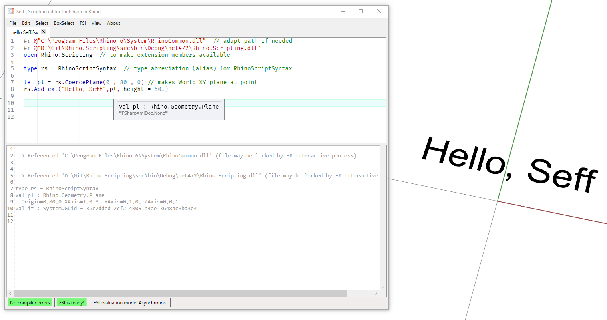

<!-- in VS Code press Ctrl+K and then V to see a preview-->
# Rhino.Scripting
Rhino.Scripting is an implementation of the **RhinoScript** syntax for F# (and C#).  
It enables the use of RhinoScript in F# and all the great coding experience that come with F#, like: 
- automatic code completion while typing
- automatic error checking and highlighting in the background 
- type info on mouse over
- type certainty even without type annotaion (type inference)

## What is RhinoScript ?

RhinoScript provides application scripting for the [Rhino3D](https://www.rhino3d.com/) CAD app.  
RhinoScript has [more than 900 functions](https://developer.rhino3d.com/api/RhinoScriptSyntax/) to controll all kind of aspects of automating Rhino3D.  
It was orignally implemented in 2002 in VBScript.   
Extensive Documentation on the original VBScript based version is available [here](https://developer.rhino3d.com/guides/rhinoscript/).


In 2010 all functions from [RhinoScript where reimplemented in IronPython](https://developer.rhino3d.com/guides/#rhinopython) (Python running on .NET).  
This allowed the use of a modern, rich and dynamically typed programming language with a huge standard libray and also access to all function of the underlying .NET Framework as well as the [RhinoCommon SDK](https://developer.rhino3d.com/guides/rhinocommon/).

## What is this repro?

This repro has [all](https://developer.rhino3d.com/api/RhinoScriptSyntax/) RhinoScript functions reimpleneted in [F#](https://fsharp.org/)  
It is literaly a translation of the open scource Ironpython [rhinoscriptsyntax](https://github.com/mcneel/rhinoscriptsyntax) implementation to F#.  

## Get started 

The recomended scripting use case is via the [Seff.Rhino](https://github.com/goswinr/Seff.Rhino) Editor.   
However you can use this libray just as well in compiled F#, C# or VB.net projects.
Or even in Grasshopper C# VB.net scripting components.

First reference the assembiles. In an F# scripting editor do
```fsharp
#r @"C:\Program Files\Rhino 6\System\RhinoCommon.dll"  // adapt path if needed
#r @"D:\Git\Rhino.Scripting\src\bin\Debug\net472\Rhino.Scripting.dll"
```   
open modules 
```fsharp
open Rhino.Scripting  // to make extension members available 

type rs = RhinoScriptSyntax  // type abreviation (alias) for RhinoScriptSyntax
```
then use any of the RhinoScript functions like you would in Python or VBScript.  
The CoerceXXX functions will help you create types if you are too lazy to fully specify them.
```fsharp
let pl = rs.CoercePlane(0 , 80 , 0) // makes World XY plane at point
rs.AddText("Hello, Seff", pl, height = 50.)
```
Screenshot from [Seff](https://github.com/goswinr/Seff.Rhino) Editor hosted in Rhino using Rhino.Scripting:



## How about the dynamic types and optional parameters from VBScript and Python?
Many RhinoScript function take variable types of input parameters. This implemented with  method overloads.
Many RhinoScript function have optional parameters. These are also implemented as optional method parameters.
### Example
for example `rs.ObjectLayer` can be called in several ways:

`rs.ObjectLayer(guid)` to get the layer of one object, returns a string  
`rs.ObjectLayer(guid, string)` to set the layer of one object (fails if layer does not exist), no return value  
`rs.ObjectLayer(guid, string, createLayerIfMissing = true )` to set the layer of one object, and create the layer if it does not exist yet, no return value  
`rs.ObjectLayer(list of guids, string)` to set the layer of several objects (fails if layer does not exist), no return value    
`rs.ObjectLayer(list of guids, string, createLayerIfMissing = true )` to set the layer of several objects, and create the layer if it does not exist yet , no return value

these are implemented with 3 overloads and optional parmeters:
```fsharp
///<summary>Returns the full layername of an object. 
/// arent layers are separated by <c>::</c></summary>
///<param name="objectId">(Guid) The identifier of the object</param>
///<returns>(string) The object's current layer</returns>
static member ObjectLayer(objectId:Guid) : string = //GET
    let obj = RhinoScriptSyntax.CoerceRhinoObject(objectId)
    let index = obj.Attributes.LayerIndex
    Doc.Layers.[index].FullPath


///<summary>Modifies the layer of an object , optionaly creates layer if it does not exist yet</summary>
///<param name="objectId">(Guid) The identifier of the object</param>
///<param name="layer">(string) Name of an existing layer</param>
///<param name="createLayerIfMissing">(bool) Optional, Default Value: <c>false</c>
///     Set true to create Layer if it does not exist yet.</param>
///<returns>(unit) void, nothing</returns>
static member ObjectLayer(
    objectId:Guid, 
    layer:string, 
    [<Optional;DefaultParameterValue(false)>]createLayerIfMissing:bool) : unit = 
        let obj = RhinoScriptSyntax.CoerceRhinoObject(objectId)   
        let layerIndex =
            if createLayerIfMissing then            
                if layer="" then 
                    Doc.Layers.CurrentLayerIndex
                else
                    let i = Doc.Layers.FindByFullPath(layer, RhinoMath.UnsetIntIndex)
                    if i <> RhinoMath.UnsetIntIndex then 
                        i
                    else
                        let names = layer.Split([| "::"|], StringSplitOptions.RemoveEmptyEntries)
                        let mutable lastparentindex =  -1
                        let mutable lastparent      =  null : DocObjects.Layer
                        for idx, name in Seq.indexed(names) do
                            let layer = DocObjects.Layer.GetDefaultLayerProperties()
                            if idx > 0 && lastparentindex <> -1 then
                                lastparent <- Doc.Layers.[lastparentindex]
                            if notNull lastparent then
                                layer.ParentLayerId <- lastparent.Id
                            layer.Name <- name
                            layer.Color <- Color.randomColorForRhino()
                            layer.IsVisible <- true
                            layer.IsLocked <- false
                            lastparentindex <- Doc.Layers.Add(layer)                        
                            if lastparentindex = -1 then
                                let mutable fullpath = layer.Name
                                if notNull lastparent then
                                    fullpath <- lastparent.FullPath + "::" + fullpath
                                lastparentindex <- Doc.Layers.FindByFullPath(fullpath, RhinoMath.UnsetIntIndex)
                        lastparentindex
            else
                RhinoScriptSyntax.CoerceLayer(layer).Index                 
        obj.Attributes.LayerIndex <- layerIndex
        if not <| obj.CommitChanges() then failwithf "Set ObjectLayer failed for '%A' and '%A'"  layer objectId
        Doc.Views.Redraw()
    

///<summary>Modifies the layer of multiple objects, optionaly creates layer if it does not exist yet</summary>
///<param name="objectIds">(Guid seq) The identifiers of the objects</param>
///<param name="layer">(string) Name of an existing layer</param>
///<param name="createLayerIfMissing">(bool) Optional, Default Value: <c>false</c>
///     Set true to create Layer if it does not exist yet.</param>
///<returns>(unit) void, nothing</returns>
static member ObjectLayer(
    objectIds:Guid seq, 
    layer:string, 
    [<Optional;DefaultParameterValue(false)>]createLayerIfMissing:bool): unit = 
        let layerIndex =
            if createLayerIfMissing then            
                if layer="" then 
                    Doc.Layers.CurrentLayerIndex
                else
                    let i = Doc.Layers.FindByFullPath(layer, RhinoMath.UnsetIntIndex)
                    if i <> RhinoMath.UnsetIntIndex then 
                        i
                    else
                        let names = layer.Split([| "::"|], StringSplitOptions.RemoveEmptyEntries)
                        let mutable lastparentindex =  -1
                        let mutable lastparent      =  null : DocObjects.Layer
                        for idx, name in Seq.indexed(names) do
                            let layer = DocObjects.Layer.GetDefaultLayerProperties()
                            if idx > 0 && lastparentindex <> -1 then
                                lastparent <- Doc.Layers.[lastparentindex]
                            if notNull lastparent then
                                layer.ParentLayerId <- lastparent.Id
                            layer.Name <- name
                            layer.Color <- Color.randomColorForRhino()
                            layer.IsVisible <- true
                            layer.IsLocked <- false
                            lastparentindex <- Doc.Layers.Add(layer)                        
                            if lastparentindex = -1 then
                                let mutable fullpath = layer.Name
                                if notNull lastparent then
                                    fullpath <- lastparent.FullPath + "::" + fullpath
                                lastparentindex <- Doc.Layers.FindByFullPath(fullpath, RhinoMath.UnsetIntIndex)
                        lastparentindex
            else
                RhinoScriptSyntax.CoerceLayer(layer).Index 
        for objectId in objectIds do
            let obj = RhinoScriptSyntax.CoerceRhinoObject(objectId)
            obj.Attributes.LayerIndex <- layerIndex
            if not <| obj.CommitChanges() then 
                let len = Seq.length objectIds
               failwithf "Set ObjectLayer failed for '%A' and '%A' of %d objects" layer objectId len
        Doc.Views.Redraw()
```
## Extras
in addition to all +900 functions from the rhinoscriptsyntax this library contains other useful utility functions.   
For example the curried `rs.setLayer` or `rs.setUsername` can be used with the pipline operator:

The `|>>` operator applies a function but retuns the input value:

```fsharp
rs.AddLine(a,b)
|>> rs.setLayer    "parent::myLayer"
|>> rs.setName     "myName"
|>  rs.setUserText "myKey" "myValue"
```
instead of 
```fsharp
let myLine = rs.AddLine(a,b)
rs.ObjectLayer(myLine, "parent::myLayer" )
rs.ObjectName (myLine, "myName")
rs.SetUserText(myLine, "myKey", "myValue")
```

All additional functionality is  directly in the `src` folder  files in [https://github.com/goswinr/Rhino.Scripting/tree/master/src](https://github.com/goswinr/Rhino.Scripting/tree/master/src).

## Contributing
Contributions are welcome even for small things like typos. If you have problems with this library please submit an issue.